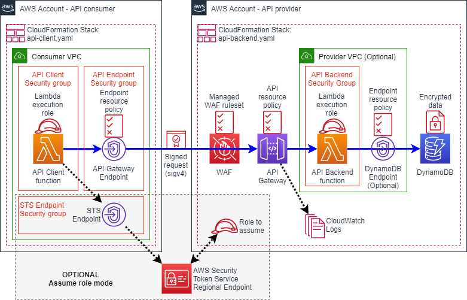
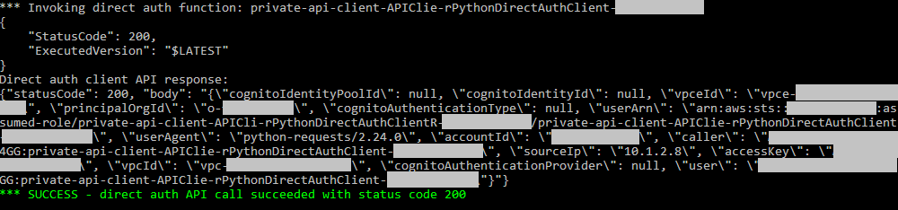
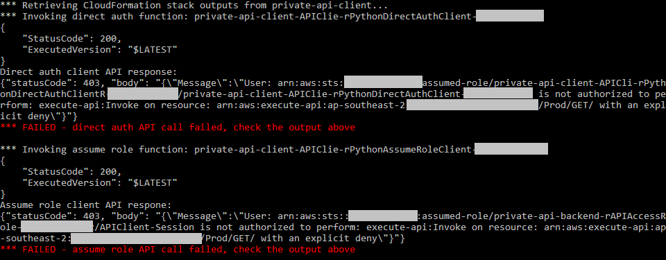

# AWS Cross Account Private API demonstration

This is a demonstration of a private API invocation between two separate AWS accounts using [Amazon API Gateway](https://aws.amazon.com/api-gateway/), without requiring any internet gateways, NAT gateways, or VPC peering.  Instead it uses features of [AWS PrivateLink](https://aws.amazon.com/privatelink/) and [VPC endpoints](https://docs.aws.amazon.com/vpc/latest/userguide/vpc-endpoints.html) to enable connectivity between accounts and VPCs.

IAM and sigv4 is used for authentication and authorization, which means you can use IAM policies to finely control access without needing to manage API keys or secrets.  

This code deploys a serverless API backend with a [private REST API Gateway endpoint](https://docs.aws.amazon.com/apigateway/latest/developerguide/api-gateway-api-endpoint-types.html#api-gateway-api-endpoint-types-private), and separate client Lambda functions written in Python.  It demonstrates SAM deployment of the following AWS services and features:

* [Amazon API Gateway Private Endpoints](https://docs.aws.amazon.com/apigateway/latest/developerguide/apigateway-private-apis.html) and [STS Endpoints](https://docs.aws.amazon.com/IAM/latest/UserGuide/id_credentials_sts_vpce.html) to avoid any internet egress traffic
* [API authentication using IAM](https://docs.aws.amazon.com/apigateway/latest/developerguide/api-gateway-control-access-using-iam-policies-to-invoke-api.html) (via [AWS Sigv4](https://docs.aws.amazon.com/general/latest/gr/signature-version-4.html) signatures)
* [Configuration of an API Resource Policy](https://docs.aws.amazon.com/apigateway/latest/developerguide/apigateway-resource-policies.html) (through the [AWS OpenAPI extension](https://docs.aws.amazon.com/apigateway/latest/developerguide/openapi-extensions-policy.html)), authorizing access by principal and a VPC endpoint whitelist
* [AWS WAF](https://aws.amazon.com/waf/) enabled on API Gateway with [AWS managed rules](https://docs.aws.amazon.com/waf/latest/developerguide/aws-managed-rule-groups.html)
* [Enhanced API Gateway Access Logging](https://aws.amazon.com/blogs/compute/troubleshooting-amazon-api-gateway-with-enhanced-observability-variables/) into CloudWatch Logs to simplify troubleshooting
* [Security Groups](https://docs.aws.amazon.com/vpc/latest/userguide/VPC_SecurityGroups.html) to control traffic at the network level
* [VPC Endpoint Policies](https://docs.aws.amazon.com/vpc/latest/userguide/vpc-endpoints-access.html#vpc-endpoint-policies) to lock down use of the VPC endpoints for access to specific resources only 
* [AWS Lambda](https://aws.amazon.com/lambda/) as the compute for both the API client and backend (although the code could be easily adapted to run elsewhere)
* [Amazon DynamoDB](https://aws.amazon.com/dynamodb/) as the backend data store, optionally accessed from within a VPC via the [DynamoDB VPC Endpoint](https://docs.aws.amazon.com/amazondynamodb/latest/developerguide/vpc-endpoints-dynamodb.html)

This code is intended as a demonstration and provides sample code artefacts that show how you can use the features above, with automated deployment using the [Serverless Application Model (SAM)](https://aws.amazon.com/serverless/sam/) and [AWS CloudFormation](https://aws.amazon.com/cloudformation/).

## Architecture



### Notes

The solution supports two different options for API authorization, which are separated into different Lambda functions for clarity.

1. **Direct** - the execution role of the client Lambda function is used to sign the request.  The role ARN is explicitly whitelisted in the API gateway resource policy.

2. **Assume role** - client assumes a role in the backend AWS account before invoking the API.   The AWS account number of the API consumer is configured in the role trust policy within the API provider account.

In addition to the above, a whitelist of VPC endpoint IDs must be provided which limits API requests to the specified endpoints.

Code is deployed in two parts:

1. API Provider: `vpc-api-backend.yaml` or `api-backend.yaml` - deploys API Gateway, backend Lambda function and DynamoDB table

2. API Consumer: `vpc-api-client.yaml` or `api-client.yaml` - deploys the VPC endpoint for API gateway and a client Lambda functions

Each stack is expected be deployed into a different AWS account.  Deploying into the same account also works, but note the difference this makes to IAM authorization of APIs (specifically the table at the end):
https://docs.aws.amazon.com/apigateway/latest/developerguide/apigateway-authorization-flow.html

In a real world situation, each stack could be deployed by a different team or organization.

Templates with `vpc-` prefix in their names also deploy the VPC and subnet resources, and create nested stacks for the API and Lambda resources passing in the necessary VPC parameters.

## Prerequisites
1. Install AWS CLI:
https://docs.aws.amazon.com/cli/latest/userguide/cli-chap-install.html

1. Install SAM CLI:
https://docs.aws.amazon.com/serverless-application-model/latest/developerguide/serverless-sam-cli-install.html

1. You will need two different AWS accounts, one for the API consumer and the other for the API provider backend.

1. Configure separate AWS CLI profiles for each AWS account:
https://docs.aws.amazon.com/cli/latest/userguide/cli-configure-profiles.html

## Quick Deployment (Automated)
A deployment script has been provided to quickly deploy the stacks into both of the AWS accounts.  Provide the CLI profile names as arguments to the `deploy-all.sh` script as follows:
```
./deploy-all.sh <consumer CLI profile> <provider CLI profile>
```
This script will execute a sequence of `sam deploy` commands to perform CloudFormation stack create and update operations.   The stacks will create various resources in your AWS accounts including IAM roles, VPCs, subnets, security groups, endpoints, APIs, Lambda functions, a DDB table and a WAF ACL as shown in the diagram above.

## Testing the API
Once the API backend and client are deployed, you can test the API by invoking the client Lambda function from the AWS console or by running the following command with your client AWS account profile.

```
./invoke.sh <consumer CLI profile>
```

This script invokes both of the client Lambda functions and displays the output.  Make sure you see `"statusCode": 200` in the client API response output, and green "SUCCESS" messages.  If it is working the API response will also include a JSON document containing all of the identity fields from the request context.

Here is an example of a successful invocation:


### Troubleshooting steps
If you see red "FAILED" messages it means the API did not return a 200 status code and something is wrong.  In this case the message will include a response from API Gateway which will provide some clues.

For example, if the VPC endpoint ID is incorrect in the API Gateway resource policy, you will see output similar to the following:



The following steps may help you diagnose a failed API request:

1. In the consumer AWS account, check the endpoint policy on the API Gateway VPC endpoint (`com.amazonaws.<region>.execute-api`): https://docs.aws.amazon.com/vpc/latest/userguide/vpce-interface.html#modify-interface-endpoint

   Confirm that the endpoint policy contains the ARN of the API gateway in the provider account.

1. Check the environment variables on the client Lambda functions all contain the correct values: https://docs.aws.amazon.com/lambda/latest/dg/configuration-envvars.html

   In particular the API_HOST, API_PREFIX and ROLE_TO_ASSUME variables must match the backend configuration exactly.

1. In the provider AWS account, check the API Gateway access logs in CloudWatch Logs: https://docs.aws.amazon.com/AmazonCloudWatch/latest/logs/Working-with-log-groups-and-streams.html#ViewingLogData

   This will help you identify where the request is failing - whether it is caused by WAF or an incorrect API resource policy, for example.

1. Check the API Gateway resource policy contains the correct values for the consumer AWS account ID, role ARNs, and VPC endpoint IDs: https://docs.aws.amazon.com/apigateway/latest/developerguide/apigateway-resource-policies-create-attach.html#apigateway-resource-policies-create-attach-console

   If any of the values are incorrect, fix them in the CloudFormation stack parameters by performing a stack update: https://docs.aws.amazon.com/AWSCloudFormation/latest/UserGuide/using-cfn-updating-stacks-direct.html

## Detailed Deployment Steps
The actions performed by the `deploy-all.sh` script are broken down in more detail below.  Use these steps if you wish to separate the provider and consumer deployments.

### Step 1 - Deploy the API backend
To begin, deploy `vpc-api-backend.yaml` (or `api-backend.yaml`) into the backend AWS account with default parameter values.  This will set a limited API resource policy that will be updated in a later step once the client is deployed.

1. Set your CLI profile to the backend account profile
   ```
   export AWS_PROFILE=<Provider AWS account profile>
   ```

2. Build and package the template for deployment (requires an S3 bucket)
   ```
   ./build-backend.sh <s3 bucket>
   ```

3. Deploy the backend stack using the following command:
   ```
   sam deploy --template-file api-backend/vpc-api-backend-deploy.yaml \
              --stack-name private-api-backend \
              --capabilities CAPABILITY_NAMED_IAM CAPABILITY_AUTO_EXPAND
   ```
   You can also deploy through the AWS CloudFormation console, if you prefer.

You have now deployed the API Gateway and backend resources in the Provider AWS account.  Take note of the `APIGatewayFQDN` and `APIAccessRole` outputs which are required in the next step.

### Step 2 - Deploy the API client
Next deploy `vpc-api-client.yaml` (or `api-client.yaml`) into the client AWS account.  Specify the `APIGatewayFQDN` value as the `pAPIHost` parameter, and the API provider account ID as the `pAPIAccountID` parameter.  

The code below deploys using the `vpc-api-client.yaml` template, which creates a new VPC and deploys the client through a nested stack.  Alternatively you can use the `api-client.yaml` template directly, and specify parameter values for the VPC ID and Subnet IDs.

1. Set your CLI profile to the client AWS account
   ```
   export AWS_PROFILE=<Consumer AWS account profile>
   ```

2. Build and package the template for deployment (requires an S3 bucket)
   ```
   ./build-client.sh <s3 bucket>
   ```

3. Deploy the client stack using a guided deploy
   ```
   sam deploy --template-file api-client/vpc-api-client-deploy.yaml --guided
   ```
   **Or** specify all the options below on the command line
   ```
   sam deploy --template-file api-client/vpc-api-client-deploy.yaml \
              --stack-name private-api-client \
              --capabilities CAPABILITY_NAMED_IAM CAPABILITY_AUTO_EXPAND \
              --parameter-overrides \
                pAPIHost=<APIGatewayFQDN> \
                pAPIAccountID=<Provider AWS Account ID> \
                pAPIRoleARN=<APIAccessRole>
   ```
   You can also deploy through the AWS CloudFormation console, if you prefer.

Take note of the `APIGatewayEndpointID` and `DirectAuthClientRole` outputs.  These will be provided to the backend stack in the next step, so your client can be properly authorized.

### Step 3 - Provide API authorization parameters to the provider
Now update the `private-api-backend` stack with the necessary parameter values to authorize the client.  

Specify the client Lambda role ARN in the `pAPIAccessList` parameter for direct invocation, and/or the client AWS account ID in the `pTrustedPrincipals` parameter for assume role.  Also provide the VPC endpoint ID as the `pAllowedVPCEndpoints` parameter.

```
sam deploy --template-file api-backend/vpc-api-backend-deploy.yaml \
           --stack-name private-api-backend \
           --capabilities CAPABILITY_NAMED_IAM \
           --profile <Provider AWS account profile> \
           --parameter-overrides \
             pTrustedPrincipals=<Consumer AWS Account ID> \
             pAPIAccessList=<DirectAuthClientRole> \
             pAllowedVPCEndpoints=<APIGatewayEndpointID>
```
Alternatively you can update the stack through the AWS CloudFormation console, changing the parameter values as above.

Finally, perform an API gateway deployment to the API stage (this isn't always done by the above sam deploy command, you may see 403 errors if it isn't done)

```
aws apigateway create-deployment --rest-api-id <API ID> --stage-name Prod
```

### Authorizing additional consumers
This demo supports authorization of multiple API consumers in different accounts with different VPC endpoints.  The authorization parameters on the `private-api-backend` stack can be specified as comma delimited lists.

For example:
```
sam deploy --template-file api-backend/vpc-api-backend-deploy.yaml \
           --stack-name private-api-backend \
           --capabilities CAPABILITY_NAMED_IAM \
           --profile <Provider AWS account profile> \
           --parameter-overrides \
             pTrustedPrincipals=<AWSAccountID1,AWSAccountID2,AWSAccountID3> \
             pAPIAccessList=<ClientRoleARN1,ClientRoleARN2,ClientRoleARN3> \
             pAllowedVPCEndpoints=<EndpointID1,EndpointID2,EndpointID3>
```
**Note** CloudFormation supports parameter values of up to a maximum of 4,096 bytes.


## Parameter Reference
This section contains parameter references for the CloudFormation templates.  VPC related parameters do not need to be specified when deploying through the `vpc-` prefixed templates, as these create the necessary VPC resources for you.

### API Provider 
The backend template is self-contained and includes some basic Lambda code as the API, which simply returns a message containing details of the fields used for authorization.

When deployed without changing any default parameters, the API will be configured with a simplistic resource policy that allows access to a specific role but nothing else.  Once the client is deployed you need to perform a stack update to allow access to the client resources (eg VPC endpoint ID).

The table below outlines the parameters.  Use the `--parameter-overrides` option on the above command to change the default.

| Parameter Name | Type | Default Value | Description |
|----------------|------|---------------|-------------|
| pTrustedPrincipals | Comma delimited list | Nobody | For access using assume role: The list of principals (AWS account IDs or ARNs) that can assume the API execution role |
| pAPIAccessList | Comma delimited list | None | For direct access from the client: List of principals (AWS account IDs or ARNs) that will be explicitly granted access through the API resource policy |
| pAllowedVPCEndpoints | Comma delimited list | None | Whitelist of VPC endpoint IDs.  If specified the API request must originate from one of the given endpoints. |
| pAPIStageName | String | Prod | API stage name (first component in the API path). |
| pAPIAccessLogRetention | Number | 60 | Number of days retention configured on the CloudWatch Logs group |
| pAPIGatewayAccountRole | Yes or No | Yes | Whether to configure the [account level API Gateway access role](https://docs.aws.amazon.com/apigateway/latest/developerguide/set-up-logging.html#set-up-access-logging-permissions), enabling access to CloudWatch logs.  If this is not set and a role has not previously been configured, the template will fail during access log configuration. |
| pEnableWAF | Yes or No | Yes | Whether to enable AWS WAF on the API Gateway. The [Core AWS managed WAF ruleset](https://docs.aws.amazon.com/waf/latest/developerguide/aws-managed-rule-groups-list.html#aws-managed-rule-groups-baseline) will be deployed. |
| pVPCID | VPC ID | | (Optional) VPC to use for deployment of the backend Lambda function. If not specified, the backend Lambda function will not be attached to a VPC. |
| pLambdaSubnetIDs | List of subnet IDs | | (Optional) List of subnet IDs to use for the backend Lambda function. Required only if VPC deployment is being performed. |
| pCreateDDBEndpoint | Yes or No | Yes | Whether or not to create the DDB VPC endpoint.  This isn't required if there is an internet egress route on the subnets (via IGW or NATGW), or if the endpoint already exists. |
| pLambdaSubnetRouteTable | Route Table ID | None | (Optional) Route table ID to update with the DDB endpoint ID.  If specified, the template will pass this value to the DDB endpoint resource, causing the route table to be updated and all DDB traffic on the associated subnets to be routed via the endpoint. |

### API Consumer
The client template includes a separate Lambda function and some dependencies which need to be installed and packaged before it can be deployed.  The `requirements.txt` file contains python module dependencies and the `build-client.sh` script contains the steps to prepare the code for packaging.

Parameters are outlined in the table below.

| Parameter Name | Type | Default Value | Description |
|----------------|------|---------------|-------------|
| pAPIHost | String | | Fully qualified domain name of the API gateway (refer to backend stack outputs) |
| pAPIPrefix | String | /Prod | Path prefix for API requests (stage name) |
| pAPIAccountID | String | Local | AWS account ID of the API Gateway resource & backend. Required to set a direct API invocation policy on the Lambda function. "Local" will be substituted with AWS::AccountID. |
| pAPITimeout | Number | 10 | API timeout in seconds |
| pAPIRoleARN | String | None | ARN of the role to assume to execute the API.  This configures the client to authenticate using an assumed role in the backend AWS account, rather than its function execution role.  If not specified ("None") the client function will use it's execution role when signing API requests. |
| pVPCID | VPC ID | | VPC to use for deployment of the Lambda function and VPC endpoints.  An existing VPC is required for this template. |
| pLambdaSubnetIDs | List of subnet IDs | | List of subnet IDs to use for the client Lambda function |
| pEndpointSubnetIDs | List of subnet IDs | | List of subnet IDs to deploy the VPC endpoints (API gateway and STS) |
| pCreateSTSEndpoint | Yes or No | Yes | Whether or not to create the STS VPC endpoint.  This isn't required if there is an internet egress route on the VPC (via IGW or NATGW), or if the endpoint already exists. |
| pEnablePrivateDNS | True or False | True | Whether to enable private DNS on the API gateway endpoint.  If not specified the Lambda function will use the VPC endpoint DNS name when connecting. |

## Security

See [CONTRIBUTING](CONTRIBUTING.md#security-issue-notifications) for more information.

## License

This library is licensed under the MIT-0 License. See the LICENSE file.